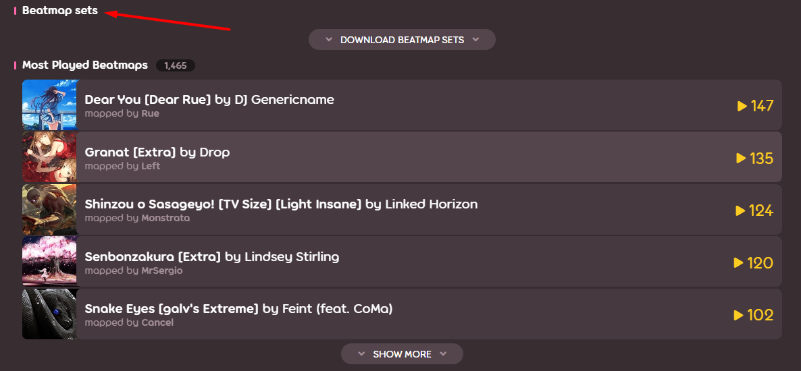
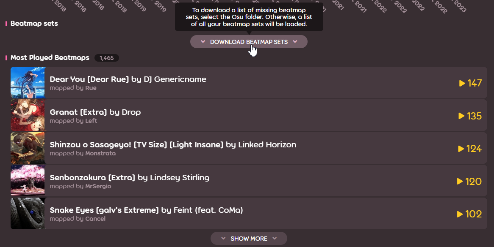
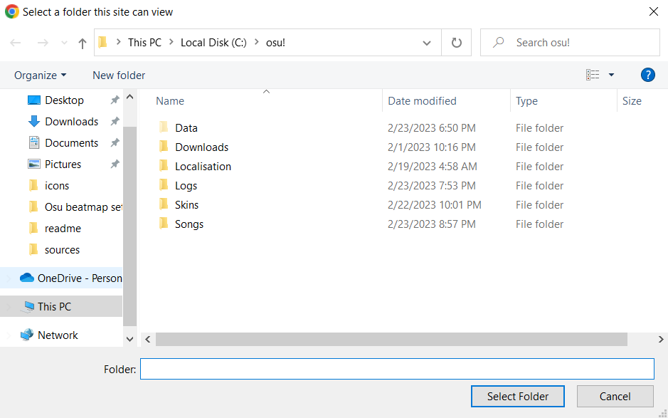
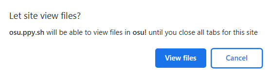
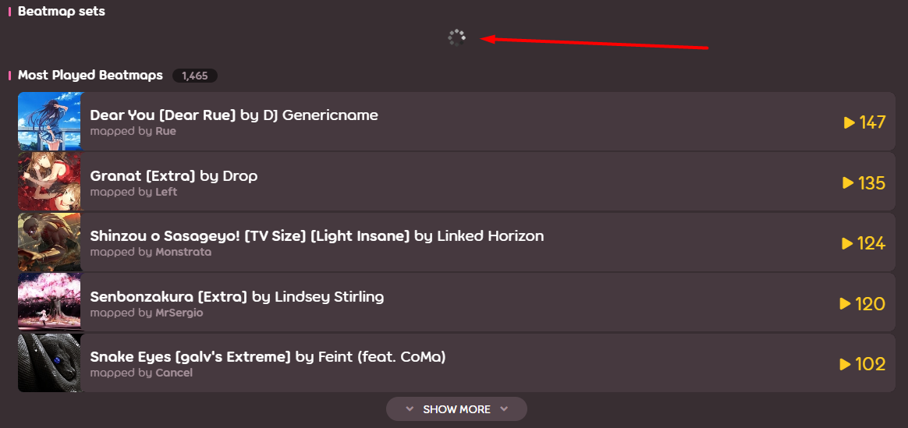
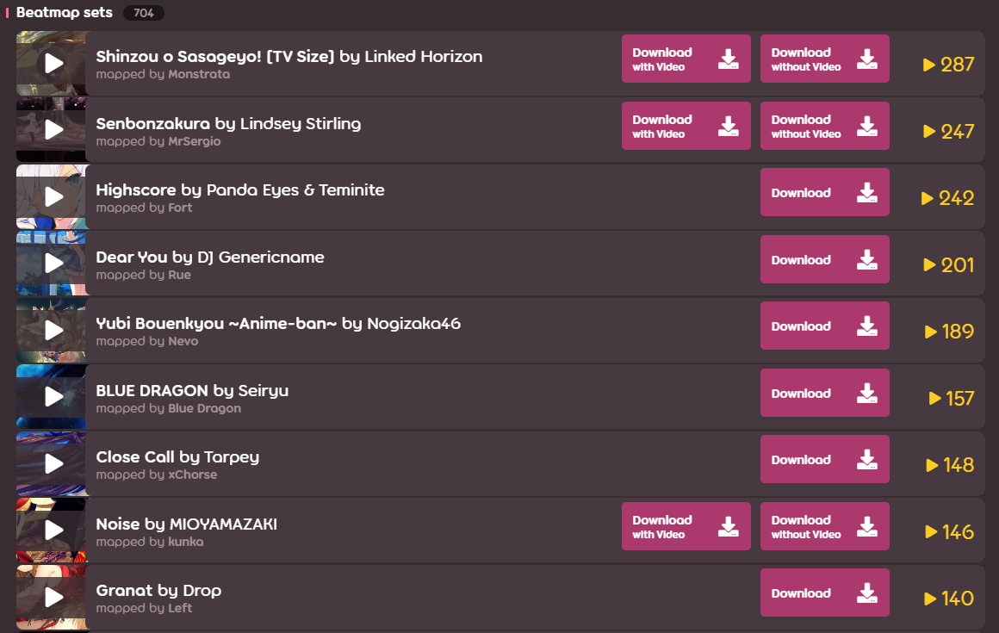
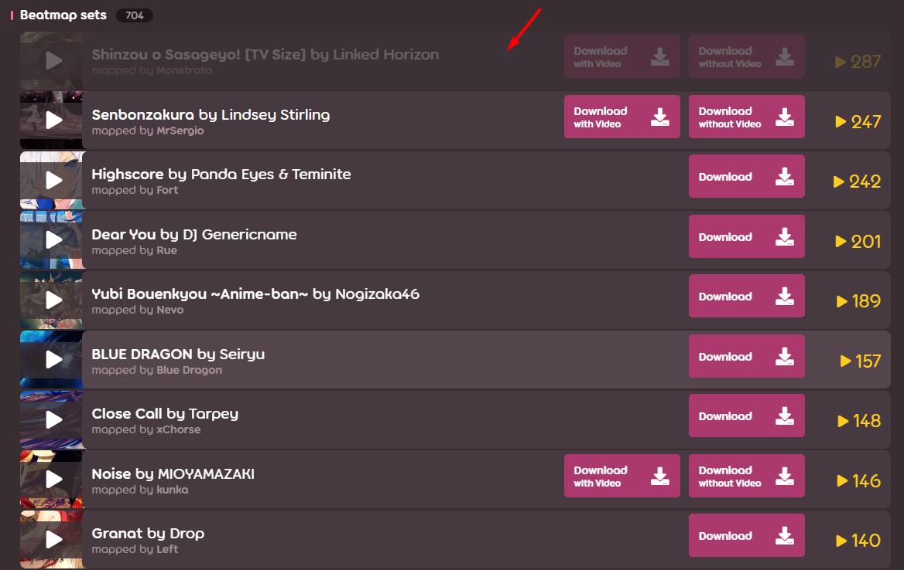
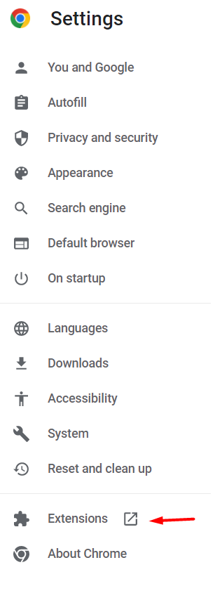
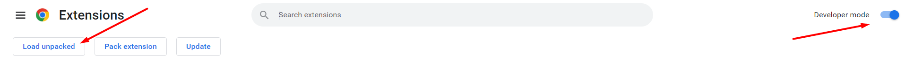

# Osu! beatmap sets scanner
An extension that allows you to display on the user page all the [Osu](https://osu.ppy.sh/home) beatmap sets that have ever been played.
This extension is necessary for more convenient restoration of the user's bitmap library, since the standard way (search for bitmaps in the "Most Played Beatmaps" list) is too long and inconvenient.

Problems that this extension solves:
1) The item "Most Played Beatmaps" displays a list of beatmaps, and separately for each difficulty, which leads to duplication of information when the user is interested in downloading the beatmap (the beatmaps themselves are downloaded as a set).
2) To download a set of beatmaps, follow the link and click the download button on another page.
3) When downloading beatmap sets, it is necessary to remember which beatmap sets have already been downloaded so as not to re-download the same data.
4) Also, when loading beatmap sets, it is necessary to take into account which beatmap sets the user already has.

## Usage:
On the user profile page, a new item "Beatmap sets" will be added before the "Most Played Beatmaps" item.

Under the new item there is a button "Download beatmap sets", which, when hovered over, displays a hint that the user will need to select a folder with the game to download a list of missing beatmap sets, or download a list of all beatmap sets ever played.

After clicking on the button, a window will appear with a directory selection, in which you need to specify the folder with the game. Thus, system folders cannot be selected, so Osu must be installed in a non-system folder.

Next, you need to allow viewing files from the selected folder.

After that, the loading of the list of beatmap sets will begin, which takes a few seconds.

Upon completion of the download, a list of beatmap sets will be displayed, the elements of which have additional buttons for listening to the demo (&#9654;) and downloading the map ("Download"). It also displays the total number of beatmap sets (the number to the right of Beatmap sets) and the total number of games for a particular beatmap set (the number to the right of the beatmap set). The list is sorted first in descending order by the total number of games in a given beatmap set, then by the name of the beatmap set in alphabetical order.

The beatmap set loaded using the suggested buttons will be darkened.

The extension is localized in all languages supported by the Osu website.

## Project development
At the moment, the extension is not published in the [Chrome web store](https://chrome.google.com/webstore/category/extensions), as the author is not ready to pay for the ability to publish extensions.

You can independently install the unpacked extension from the source files ([Download sources](https://github.com/Andreyman76/Osu-beatmap-sets-scanner/archive/refs/heads/main.zip)). To do this, select "Extensions" in the Chrome settings.

Next, you need to enable developer mode, click the "Load unpacked" button and select the "source" folder from the sources.

